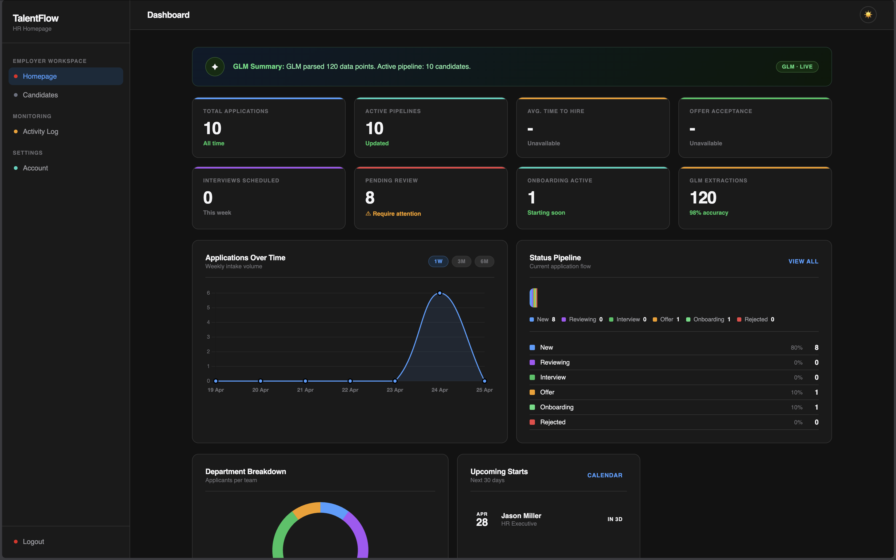
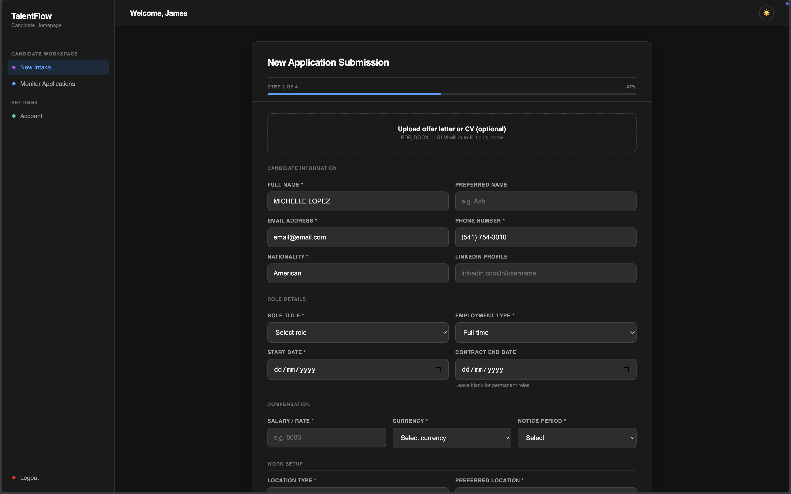
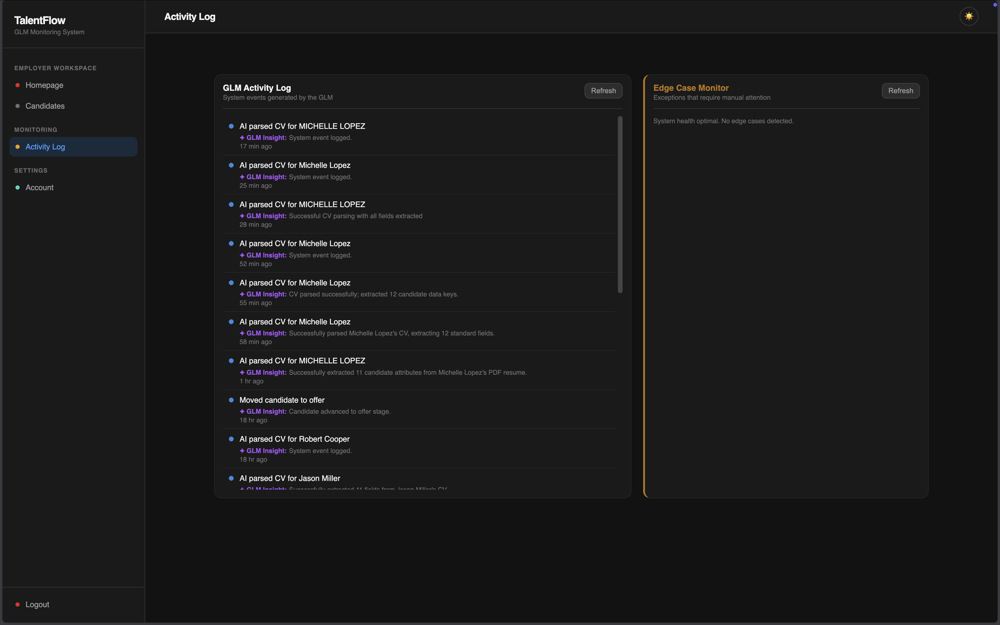
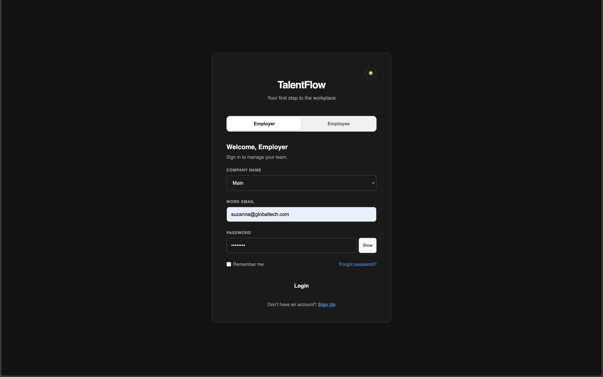

# TalentFlow
 


 
---
## Pitch Deck Video

**[Watch the TalentFlow Pitch Deck Video](https://drive.google.com/file/d/1mfj-6BnDn207HPGwTecjGpS3OhOwKRPV/view?usp=drivesdk)**
 
## Table of Contents
- [Overview](#-overview)
- [Features](#-features)
- [Screenshots](#-screenshots)
- [Technologies Used](#️-technologies-used)
- [Architecture](#️-architecture)
- [Project Structure](#-project-structure)
- [Installation](#-installation)
- [Usage](#-usage)
- [API Endpoints](#-api-endpoints)
- [Future Enhancements](#-future-enhancements)
- [Team Members](#-team-members)
- [Acknowledgments](#-acknowledgments)
---
 
## 🌟 Overview
 
**TalentFlow** is an AI-powered talent management and recruitment platform designed to connect employers and job candidates through a smart, streamlined hiring workflow. It provides real-time application tracking, AI-generated candidate analysis, and role-based dashboards — giving employers the insights they need to hire confidently, and candidates a clear, guided application experience. TalentFlow addresses key pain points in the modern recruitment process:
 
- Helping employers cut through large volumes of applications with AI-assisted scoring
- Giving candidates a transparent, guided path to submitting strong applications
- Centralising user management, dashboards, and application tracking in one platform
TalentFlow combines a FastAPI backend, Supabase for authentication and data storage, and an AI model via Ilmu API to turn raw application data into meaningful hiring recommendations.
 
---
 
## ✨ Features
 
### For Employers
- **Application review dashboard** — View and manage all incoming candidate applications in one place
- **AI-powered candidate scoring** — Each application is automatically scored and analysed by an AI model
- **CV extraction** — Upload a PDF CV and have candidate details auto-filled via AI parsing
- **Role & department filtering** — Organise applications by job title and department
- **Monitoring dashboard** — Track the AI analysis pipeline and application activity in real time
### For Candidates
- **Guided application flow** — Step-by-step form to submit skills, experience, and supporting details
- **Personal dashboard** — View application history and current status
- **Account management** — Update personal information and preferences
### Authentication & Access Control
- **Role-based login** — Separate portals for employers and employees
- **Company verification** — Employers must match their registered company at login
- **Secure session management** — HTTP-only cookies with configurable expiry
- **Server-side role verification** — Prevents cross-role access at the API level
### User Experience
- **Light / dark theme toggle** — Comfortable viewing in any environment
- **Responsive design** — Works across desktop and mobile screen sizes
- **Intuitive navigation** — Clean sidebar layout with clear role-specific flows
---
 
## 📸 Screenshots

 
**Employer Dashboard**
Dashboard showing incoming applications, AI scores, and role breakdowns


 
**Candidate Application Form**
Step-by-step application interface with skills input and form details



**AI Monitoring Dashboard**
Real-time view of the AI analysis pipeline and recommendation outputs



**Login Page**
Role-switcher login page supporting both employer and employee sign-in
 


---
 
## 🛠️ Technologies Used
 
| Category | Technology |
|---|---|
| Frontend | HTML5, CSS3, JavaScript (Vanilla) |
| Backend | Python, FastAPI, Uvicorn |
| Database & Auth | Supabase (PostgreSQL + Supabase Auth) |
| AI Analysis | OpenRouter API (GLM-4.5-air model via zai-sdk / OpenAI-compatible) |
| CV Parsing | PyMuPDF (text extraction from uploaded PDF CVs) |
| File Uploads | python-multipart |
| Environment Config | python-dotenv |
| Version Control | Git & GitHub |
 
---
 
## 🏛️ Architecture
 
TalentFlow follows a clear separation between frontend, backend, and external services:
 
```
[ Browser / HTML Frontend ]
         │
         │  HTTP requests (fetch API)
         ▼
[ FastAPI Backend — main.py ]
    ├── Auth routes       (/signup, /login, /logout, /companies)
    ├── Profile routes    (/me, /account-info, /update-account)
    ├── Application routes(/applications, /applications/{id}, /applications/{id}/status)
    ├── Employee routes   (/employee/applications)
    ├── Employer routes   (/hr/dashboard)
    ├── CV routes         (/extract-cv)
    └── Monitoring routes (/monitoring/logs)
         │                        │
         ▼                        ▼
[ Supabase ]              [ OpenRouter API — GLM-4.5-air ]
  - Auth users              - Candidate scoring & analysis
  - profiles table          - CV data extraction from PDF
  - applications table      - Activity log summarisation
  - application_status table
  - activity_logs table
```
 
**Key Architectural Decisions:**
- **Cookie-based sessions** — Stateless JWT tokens stored in HTTP-only cookies for security
- **Role enforcement at API level** — The backend verifies user role on every protected route, not just the frontend
- **AI as a side-effect** — AI analysis is triggered automatically on application submission, results stored alongside the application record
- **Background logging** — Activity events are logged asynchronously via `BackgroundTasks` so they never block the main response
- **Vanilla frontend** — No framework dependencies; plain HTML/CSS/JS for simplicity and fast load times
---
 
## 📁 Project Structure
 
```
talentflow-main/
├── main.py               # FastAPI backend — all routes and business logic
├── requirements.txt      # Python dependencies
├── .env                  # Environment variables (never commit this)
│
├── design.css            # Shared design system and CSS variables
├── navbar.css            # Navigation bar styles
├── theme.js              # Light/dark theme toggle logic
│
├── login.html            # Login page (employer & employee toggle)
├── signup.html           # New user registration page
├── template.html         # Base HTML template
│
├── employerHome.html     # Employer main dashboard
├── employerAcc.html      # Employer account settings
│
├── employeeHome.html     # Employee new application intake
├── employeeMonitor.html  # Employee monitor applications
├── employeeAcc.html      # Employee account settings
├── candidate.html        # Candidate profile and application view
│
└── monitoring.html       # AI monitoring dashboard
```
 
---
 
## 📥 Installation
 
Follow these steps to run TalentFlow locally:
 
```bash
# Clone the repository
git clone <your-repo-url>
cd talentflow-main
 
# Install Python dependencies
pip install -r requirements.txt
 
# Set up your environment variables
cp .env.example .env
# Then fill in your values in .env
```
 
**`.env` variables required:**
 
```env
SUPABASE_URL=your_supabase_project_url
SUPABASE_KEY=your_supabase_anon_or_service_key
Z_AI_API_KEY=your_openrouter_api_key
SERVICE_ROLE=your_supabase_service_role_jwt
```
 
> ⚠️ **Never commit your `.env` file.** Add it to `.gitignore`.
 
**Supabase setup — create these tables:**
 
`profiles`
| Column | Type |
|---|---|
| id | uuid (primary key, references auth.users) |
| full_name | text |
| email | text |
| phone | text |
| role | text (`employer` or `employee`) |
| company | text (nullable) |
| created_at | timestamptz |
| updated_at | timestamptz |
 
`applications`
| Column | Type |
|---|---|
| id | uuid (auto-generated) |
| candidate_id | uuid |
| full_name | text |
| email | text |
| role_title | text |
| department | text |
| skills | jsonb |
| form_details | jsonb |
| start_date | date (nullable) |
| recommendation_rate | numeric (nullable) |
| ai_analysis | text (nullable) |
 
`application_status`
| Column | Type |
|---|---|
| application_id | uuid (FK → applications.id) |
| employer_id | uuid (FK → profiles.id) |
| status | text |
| updated_at | timestamptz |
| notes | text |
 
`activity_logs`
| Column | Type |
|---|---|
| id | uuid (auto-generated) |
| user_id | uuid |
| event_type | text |
| category | text (`info`, `warning`, `error`) |
| description | text |
| ai_note | text |
| metadata | jsonb |
| created_at | timestamptz |
 
### Prerequisites
- Python 3.10+
- A [Supabase](https://supabase.com) project
- An [OpenRouter] API key (Model: GLM-4.5-air)
- VS Code with Live Server extension (or any static file server on port 5500)
---
 
## 🚀 Usage
 
**1. Start the backend:**
```bash
uvicorn main:app --reload
```
The API will be available at `http://127.0.0.1:8000`.
 
**2. Serve the frontend:**
 
Open the project folder with VS Code Live Server (or any local server on port `5500`). Type `http://127.0.0.1:5500/login.html` in a web browser to begin.
 
```bash
python3 -m http.server 5500
```
 
**3. Create an account:**
 
Sign up as either an **Employer** or **Employee** via the signup page.
 
**4. Explore your dashboard:**
 
- Employers land on `employerHome.html` — view applications, AI scores, and manage roles
- Employees land on `employeeHome.html` — submit applications and track status
---
 
## 🔌 API Endpoints
 
| Method | Endpoint | Auth Required | Description |
|---|---|---|---|
| `POST` | `/signup` | ❌ | Register a new employer or employee |
| `POST` | `/login` | ❌ | Authenticate and receive a session cookie |
| `POST` | `/logout` | ❌ | Clear session cookies |
| `GET` | `/companies` | ❌ | Fetch list of registered employer companies (for login dropdown) |
| `GET` | `/me` | ✅ | Return current user ID and email |
| `GET` | `/account-info` | ✅ | Fetch full profile data |
| `PATCH` | `/update-account` | ✅ | Update name, phone, company, or password |
| `POST` | `/extract-cv` | ✅ | Upload a PDF CV — AI extracts and returns structured candidate data |
| `POST` | `/applications` | ✅ | Submit application — triggers AI scoring and activity logging |
| `GET` | `/applications/{app_id}` | ✅ | Fetch a single application by ID (candidate only) |
| `PATCH` | `/applications/{app_id}/status` | ✅ | Update pipeline status and optional start date for a candidate |
| `GET` | `/employee/applications` | ✅ | Fetch all applications submitted by the current employee |
| `GET` | `/hr/dashboard` | ✅ | Employer dashboard — pipeline counts, dept stats, trends, upcoming starts |
| `GET` | `/monitoring/logs` | ✅ | Fetch the 20 most recent AI activity log entries |
 
All protected endpoints require a valid `access_token` cookie set at login.
 
---
 
## 🔮 Future Enhancements
 
Planned improvements for future versions:
 
- **Live data integration** — Connect to real HR systems and live job listing APIs
- **Advanced AI models** — Upgrade to more capable LLMs for deeper candidate analysis
- **Interview scheduling** — In-platform scheduling between employers and shortlisted candidates
- **Notification system** — Email or push alerts for application status changes
- **Analytics dashboard** — Hiring funnel metrics and department-level reporting
- **Mobile app** — Native mobile experience for on-the-go hiring management
- **Multi-language support** — Localisation for Southeast Asian languages
---
 
## 👥 Team Members
 
1. Grace Wong Xin En
2. Lim Jing Jie 
3. Abhishek Prakash
4. Oh Kuan Qi

## 🙏 Acknowledgments

We would like to express our gratitude to the following organizations and individuals who made TalentFlow possible:

🏛️ The Organizers & Ecosystem

UMHackathon 2026 Committee: For organizing a high-caliber competition that challenges the boundaries of student innovation in Malaysia.

🛠️ Technical Infrastructure

ILMU.AI Team: A special acknowledgment for the GLM-5.1 model. Leveraging a local LLM was central to our mission of building a Sovereign AI solution that keeps Malaysian talent data secure and contextually relevant.

Supabase & FastAPI: For the robust open-source tooling that allowed us to implement production-grade features like Row-Level Security (RLS) and asynchronous processing under extreme time constraints.

🎓 Mentorship & Academic Support

The UMHackathon Mentors: Specifically for the insights regarding the National AI Governance and Ethics (AIGE) framework, which helped us pivot toward a more transparent, human-in-the-loop feedback system.

Sunway University: For fostering a technical environment that encourages multidisciplinary collaboration between Computer Science and Economics.
